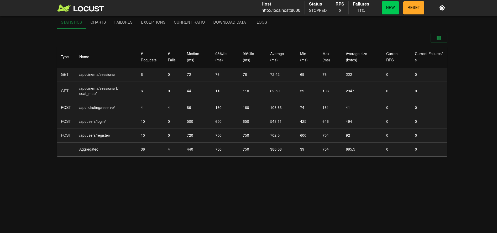

# CineReserve-API
The CineReserve API is a high-performance, scalable RESTful backend designed to manage the complexities of modern cinema operations

The CineReserve API is a high-performance, scalable RESTful backend designed to manage the complexities of modern cinema operations (specifically designed for *Cinépolis Natal*). Built with Python, Django REST Framework, PostgreSQL, and Redis, it handles high-concurrency ticket reservations with temporary distributed locks.

## Technologies Used
* **Language:** Python 3.12
* **Framework:** Django 5 & Django REST Framework (DRF)
* **WSGI HTTP Server:** Gunicorn (Production-ready with 4 workers)
* **Database:** PostgreSQL 16
* **Cache & Locks:** Redis 7
* **Task Queue:** Celery
* **Containerization:** Docker & Docker Compose
* **Dependency Management:** Poetry
* **CI/CD:** GitHub Actions (Ruff, Pytest, Coverage)
* **Locust**

---

## How to Run the Project (Locally)

This project uses Docker to provide a seamless "plug-and-play" experience. You do not need to install Python, PostgreSQL, or Redis on your local machine—Docker handles everything.

### Prerequisites
* [Docker](https://docs.docker.com/get-docker/) installed and running.
* [Docker Compose](https://docs.docker.com/compose/install/) installed.

### Step 1: Clone the repository
```bash
$ git clone https://github.com/RamonJales/cine-reserve-api.git

$ cd cine-reserve-api
```

### Step 2: Configure Environment Variables

Create a `.env` file in the root directory. You can copy the following configurations:
Snippet de código

```
DEBUG=True
SECRET_KEY=your-super-secret-key-change-in-production
POSTGRES_DB=cinereserve
POSTGRES_USER=postgres
POSTGRES_PASSWORD=postgres
DATABASE_URL=postgres://postgres:postgres@db:5432/cinereserve
REDIS_URL=redis://redis:6379/0
```

### Step 3: Build and Run the Containers

Start the API(running on Gunicorn), Database, and Redis cache in detached mode:

```bash
$ docker compose up --build -d
```

### Step 4: Run Database Migrations

Apply the initial migrations to construct the PostgreSQL schema:

```bash
docker compose exec web python manage.py migrate
```

### Step 5: Create a Superuser (Optional but recommended)

Create an admin account to access the Django Admin panel:

```bash
docker compose exec web python manage.py createsuperuser
```

### Step 6: Access the API

- Base API URL: http://localhost:8000/api/
- Admin Panel: http://localhost:8000/admin/
- Swagger: http://localhost:8000/api/docs/

### Populating the Database & End-to-End Testing

To properly test the API, you need data. We have included a custom Django management command to generate a test movie, room, and seating arrangement, alongside a robust Bash script that simulates a full user journey.

Seed the Database

Populate your local database with initial testing data (Movie, Room, Session, and Seats):

```bash
docker compose exec web python manage.py seed_cinema
```

Run the End-to-End (E2E) Test

We provide a Bash script (`e2e_test.sh`) that tests the entire flow: User Registration -> Login (JWT) -> Fetch Catalog -> Check Seat Map -> Acquire Redis Lock -> Checkout.

First, make the script executable:

```bash
chmod +x e2e_test.sh
```

Then, run the script:

```bash
./e2e_test.sh
```

**Note**: The script relies on `jq` to parse JSON responses. Ensure `jq` is installed on your local machine.

### Running Tests

To run the automated test suite (Pytest) and check coverage inside the container:

```bash
docker compose exec web pytest --cov
```

Outside container, with poetry:

```bash
DATABASE_URL="sqlite:///db.sqlite3" poetry run pytest --cov
```

### Code Quality (Linting & Formatting)

We use ruff to maintain strict code quality:

```bash
$ docker compose exec web ruff check .
$ docker compose exec web ruff format .
```

Outside container:
```bash
$ poetry run ruff check .
$ poetry run ruff check --fix
$ poetry run ruff format .
```

## High-Concurrency & Load Testing (Locust)

To prove the reliability of the **Redis Distributed Lock**, we implemented a stress test using [Locust](https://locust.io/). 

The scenario simulates a highly anticipated movie premiere where multiple concurrent users attempt to reserve the exact same seat (Seat A1) in the exact same millisecond.

Because the Docker container runs on Gunicorn (handling requests via multi-threading/multi-processing), the requests actually reach the application layer simultaneously, pushing the system to its limits.

### Running the Load Test
1. Seed the database: `docker compose exec web python manage.py seed_cinema`
2. Start Locust: `poetry run locust -f load_tests/locustfile.py --host=http://localhost:8000`
3. Open `http://localhost:8089`, set Users to `50` and Spawn Rate to `10`, and start the swarm.

### The Results (Zero Race Conditions)
Because we implemented atomic `SET NX EX` locks in Redis via our Service layer, the API perfectly handles the massive spike. 
* **Successes:** Exactly `1` request returns `HTTP 200 OK`.
* **Failures:** The remaining  requests are successfully intercepted by the lock and safely return `HTTP 400 Bad Request` ("Seat already reserved") without touching the PostgreSQL database.
* **Database Integrity:** Zero double-bookings.

    